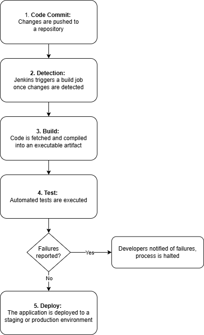

# Curiosity Report: Jenkins
### Overview
Jenkins is an open-source automation server that is used for CI/CD pipelines. Comparable to GitHub Actions, it builds, tests, and deploys code after a commit. This automation accelerates the software development lifecycle, allowing developers to catch bugs early and quickly build projects without intense task repetition. Initially developed as the Hudson project in 2011, Jenkins has scaled into one of the most widely used CI/CD tools in the industry due to its open-source nature and large plugin availability.

### How does it work?
Jenkins utilizes a multi-step process as illustrated in the diagram below. It involves several steps, typically triggering after a code commit and then executing a build, test, and deployment phase. 
If a step fails, particularly a test, the process halts and informs developers of the error in order to prevent bugs from manifesting in the deployed application.     
    


### Example Jenkinsfile
Below is an example of a Jenkinsfile, which briefly defines the CI/CD pipeline as code. This allows for version control and reproducibility.        
```
pipeline {
agent any
stages {
    stage('Build') {
        steps {
            echo 'Building project...'
        }
    }
    stage('Test') {
        steps {
            echo 'Running tests...'
        }
    }
    stage('Deploy') {
        steps {
            echo 'Deploying application...'
        }
    }
}
}

```

### Benefits
Jenkins reduces human error and task repetition, with high flexibility and extensibility for developers. With over 2,000 available plugins, Jenkins can be customized to any individual's needs. 
Popular plugins and their best use cases are included in the table below. 
| Plugin Name            | Use Case                       |
|-------------------|---------------------------------------------|
| **Git Plugin**         | Connects GitHub data and repositories to your Jenkins environment        | 
| **Pipeline Plugin** | Manages Jenkins CI/CD pipelines             |
| **Docker Plugin** | Manages Docker containers and services. This includes the creation, modification, and management of Docker images | 
| **Jira Plugin** | Connects Jenkins to Atlassian Jira, a project management and issue-tracking software for development teams |
| **SonarQube Plugin**      | Operates alongside Jenkins tasks whilst identifying bugs, duplications, and vulnerabilities |
| **Amazon EC2 Plugin**      | Connects Jenkins to Amazon EC2 services, allowing for direct EC2 support and operations within the Jenkins system  |

### Jenkins vs. GitHub Actions
- Jenkins is self-hosted and highly customizable
- GitHub Actions is cloud-based and offers a simpler setup
- Jenkins has more flexibility; GitHub Actions has better integration with GitHub
  
### Limitations
- Requires manual setup and frequent maintenance
- Plugin management can become complex
- Scaling is less straightforward
- UI can feel outdated
  
### Conclusion
Despite the rise of other CI/CD pipeline tools, Jenkins remains a powerful and flexible option in the current software development industry.
Its extensibility and control make it optimal for complex projects, though it comes with increased setup and maintenance. In a real-world use case,
Jenkins would be ideal for automating testing and deployment of a company web application. This would ensure that updates could be released quickly without
extensive task repetition. 

### References
https://codefresh.io/learn/jenkins/    
https://www.jenkins.io/    
https://www.geeksforgeeks.org/devops/jenkins-plugins/
