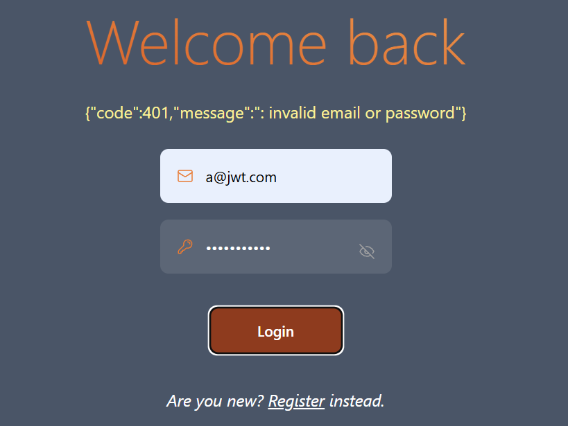
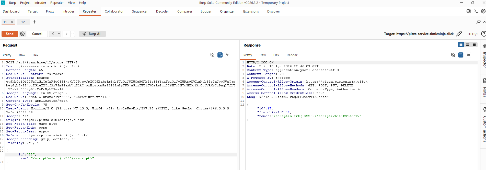
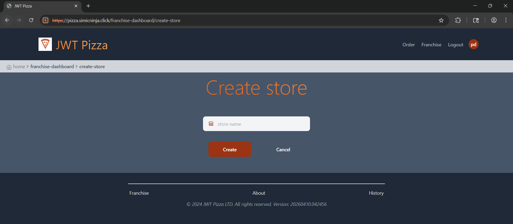
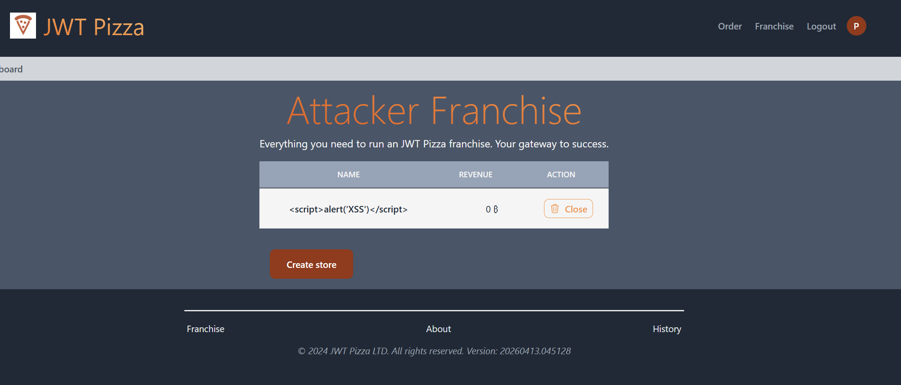
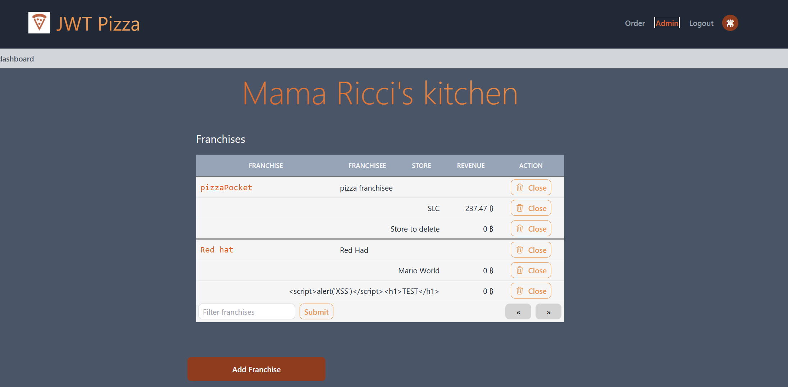

# Penetration Tests
____
Participants: Piper Dickson, Owen Werts     

## Self-Attacks
### Piper Dickson
|  Item         | Result  |
|---------------|---------|        
| Date          | April 9, 2026   |
| Target        | https://pizza.piperin.click |
| Classification| Injection  |
| Severity      | 0  |
| Description   | Injection attack failed, no tables dropped, no successful logins  |
| Images        |   |   
| Corrections   | None needed  |

|  Item         | Result  |
|---------------|---------|        
| Date          | April 9, 2026   |
| Target        | https://pizza.piperin.click  |
| Classification| Brute-force  |
| Severity      |  3 |
| Description   | Access to administrator privileges granted, franchises and user information at risk  |
| Images        |    |   
| Corrections   | Admin password adjusted to be more secure  |

|  Item         | Result  |
|---------------|---------|        
| Date          | April 9, 2026   |
| Target        | https://pizza.piperin.click  |
| Classification| Cross-site Scripting (XSS)  |
| Severity      | 0  |
| Description   | HTML tags and JavaScript references were sucessfully ignored by the application  |
| Images        |    |   
| Corrections   | None needed  |

|  Item         | Result  |
|---------------|---------|        
| Date          | April 9, 2026   |
| Target        | https://pizza.piperin.click  |
| Classification| Authentication Failure/Bypass  |
| Severity      |  0 |
| Description   | Auth token adjusted to include admin role for non-admin user |
| Images        |   |   
| Corrections   |  None needed, authorization correctly denied even with admin token |

|  Item         | Result  |
|---------------|---------|        
| Date          | April 9, 2026   |
| Target        | https://pizza.piperin.click  |
| Classification| Indirect Object Reference |
| Severity      |  0 |
| Description   |  Franchisee token adjusted to include data from non-owned franchises. Application successfully denied request |
| Images        |   |   
| Corrections   |  None needed |

### Owen Werts
|  Item         | Result  |
|---------------|---------|        
| Date          | April 9, 2026 |
| Target        | https://pizza.simicninja.click |
| Classification| Injection |
| Severity      | 0 |
| Description   | Attempted a stored XSS attack on the create store option for a franchisee. Attack failed and stored script was displayed as text. |
| Images        |  |
| Corrections   | None, since the attack failed. |

|  Item         | Result  |
|---------------|---------|        
| Date          | April 12, 2026   |
| Target        | https://pizza.simicninja.click |
| Classification| Broken Access Control |
| Severity      | 1 |
| Description   | Basic users (without franchisee or admin roles) are able to access the webpage to create a store. | 
| Images        |  |
| Corrections   | Created functions to test user role in app.tsx. Applied role constraints to following routes: Create Franchise, Close Franchise, Create Store, Close Store, Docs |

|  Item         | Result  |
|---------------|---------|        
| Date          | April 9, 2026   |
| Target        | https://pizza.simicninja.click |
| Classification|  |
| Severity      |  |
| Description   |  |
| Images        |  |   
| Corrections   |  |

|  Item         | Result  |
|---------------|---------|        
| Date          | April 9, 2026   |
| Target        | https://pizza.simicninja.click |
| Classification|  |
| Severity      |  |
| Description   |  |
| Images        |  |   
| Corrections   |  |

|  Item         | Result  |
|---------------|---------|        
| Date          | April 9, 2026   |
| Target        | https://pizza.simicninja.click |
| Classification|  |
| Severity      |  |
| Description   |  |
| Images        |  |   
| Corrections   |  |

## Peer Attacks
___
### Piper Dickson
|  Item         | Result  |
|---------------|---------|        
| Date          | April 14, 2026   |
| Target        | https://pizza.simicninja.click |
| Classification| Cross-site Scripting (XSS)|
| Severity      | 0 |
| Description   | Attempted manual cross-site scripting attacks via the franchise store creation page. This failed, and was one of the few places where user input was reflected on the application |
| Images        |   |   
| Corrections   | None needed |

|  Item         | Result  |
|---------------|---------|        
| Date          | April 14, 2026   |
| Target        | https://pizza.simicninja.click |
| Classification| Injection |
| Severity      | 0 |
| Description   | DROP TABLE injection attack attempted. Application properly sanitized inputs and no data was affected |
| Images        |   |   
| Corrections   | None needed |

|  Item         | Result  |
|---------------|---------|        
| Date          | April 14, 2026   |
| Target        | https://pizza.simicninja.click |
| Classification| Brute-force |
| Severity      | 3 |
| Description   | Access to administrator privileges granted through brute-force password attempts. User and franchise information now at risk |
| Images        |   |   
| Corrections   | Admin password should be adjusted to be more secure |

|  Item         | Result  |
|---------------|---------|        
| Date          | April 14, 2026   |
| Target        | https://pizza.simicninja.click |
| Classification| Indirect Object Reference  |
| Severity      |  |
| Description   |  |
| Images        |  |   
| Corrections   |  |

|  Item         | Result  |
|---------------|---------|        
| Date          | April 14, 2026   |
| Target        | https://pizza.simicninja.click |
| Classification| Authentication Failure/Bypass |
| Severity      |  |
| Description   |  |
| Images        |  |   
| Corrections   |  |

### Owen Werts

## Combined Summary of Learnings