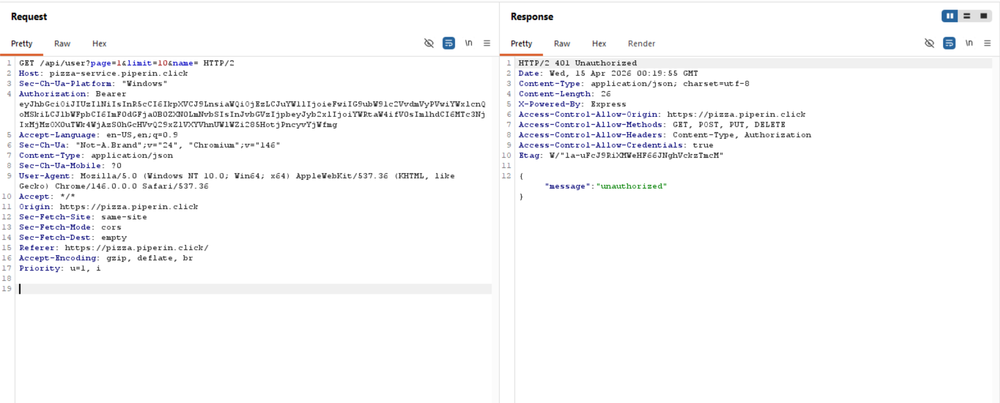
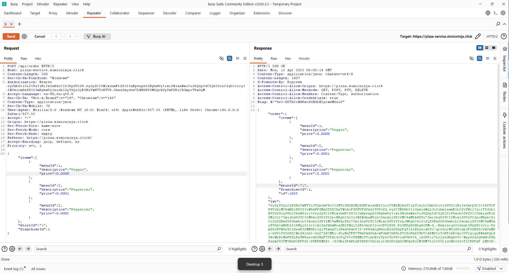
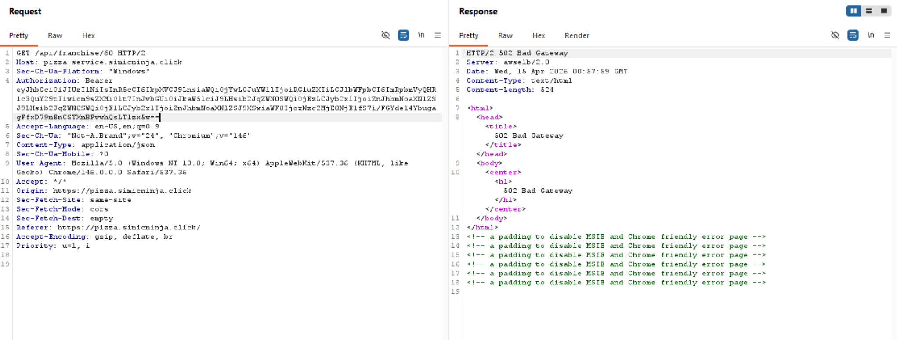
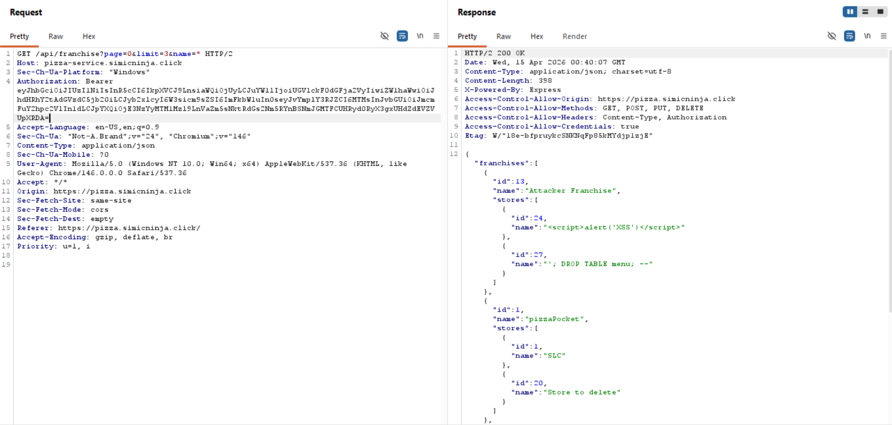
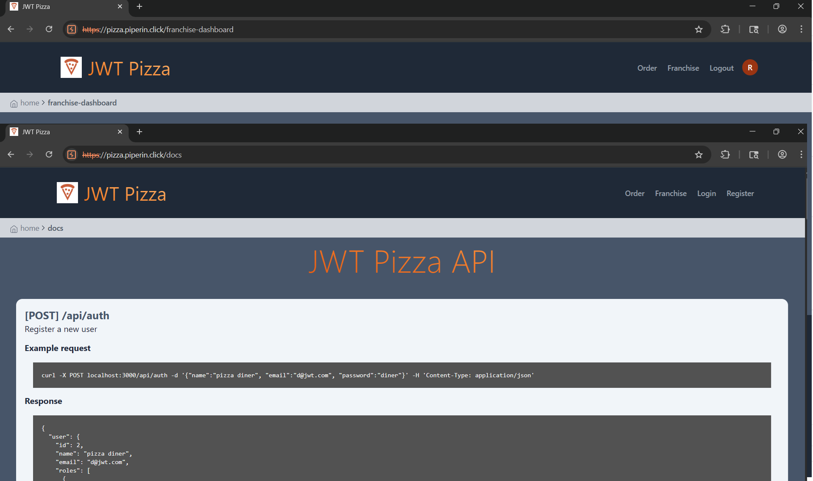
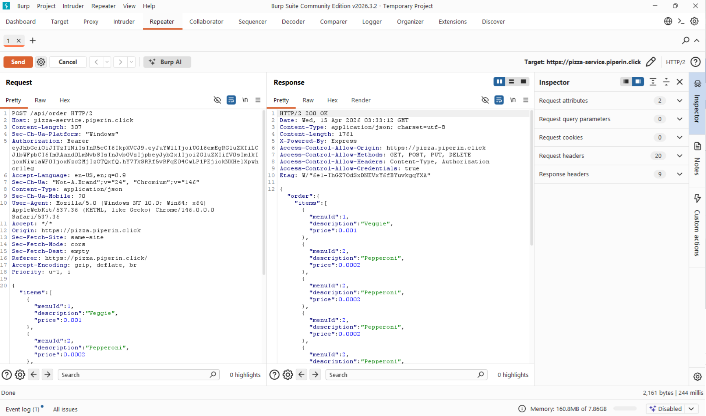
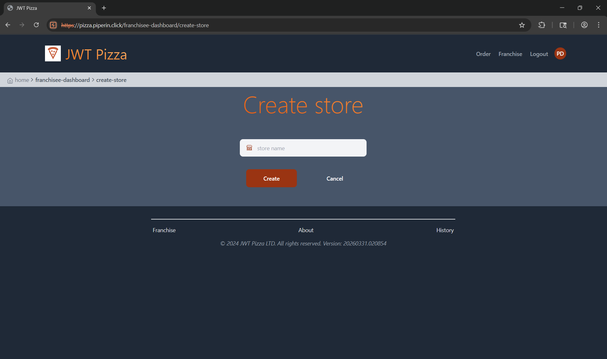
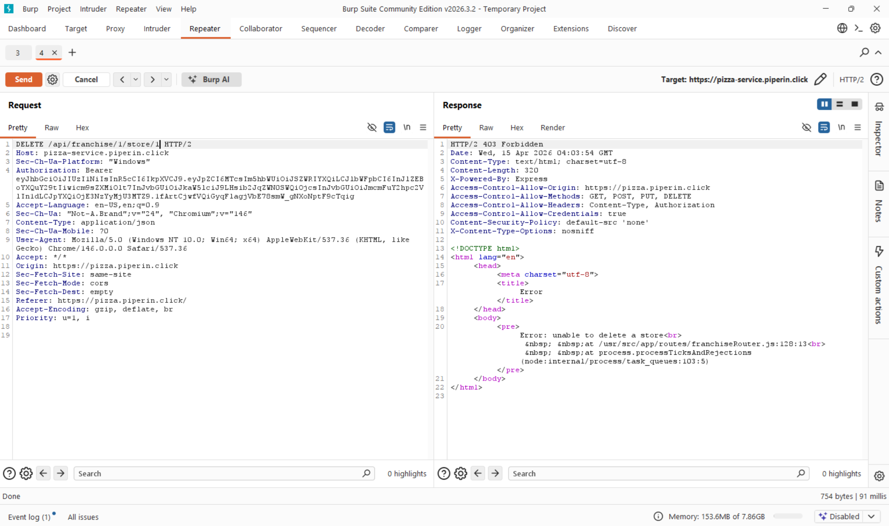
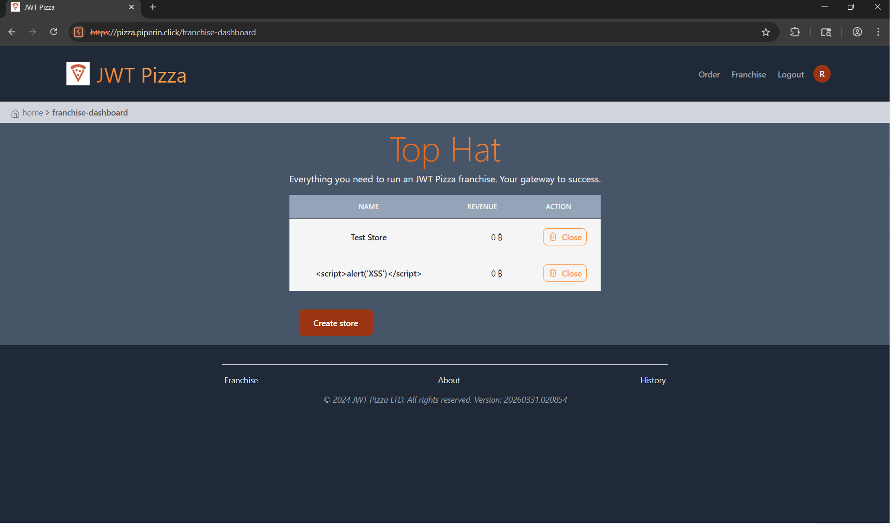

# Penetration Tests
____
Participants: Piper Dickson, Owen Werts     

## Self-Attacks
### Piper Dickson
#### 1. SQL Injection
|  Item         | Result  |
|---------------|---------|        
| Date          | April 9, 2026   |
| Target        | https://pizza.piperin.click |
| Classification| Injection  |
| Severity      | 0  |
| Description   | Injection attack failed, no tables dropped, no successful logins  |
| Images        |   |   
| Corrections   | None needed  |
#### 2. Password Brute-Force
|  Item         | Result  |
|---------------|---------|        
| Date          | April 9, 2026   |
| Target        | https://pizza.piperin.click  |
| Classification| Brute-force  |
| Severity      |  3 |
| Description   | Access to administrator privileges granted, franchises and user information at risk  |
| Images        |    |   
| Corrections   | Admin password adjusted to be more secure  |
#### 3. XSS
|  Item         | Result  |
|---------------|---------|        
| Date          | April 9, 2026   |
| Target        | https://pizza.piperin.click  |
| Classification| Cross-site Scripting (XSS)  |
| Severity      | 0  |
| Description   | HTML tags and JavaScript references were sucessfully ignored by the application  |
| Images        |    |   
| Corrections   | None needed  |
#### 4. Auth Token Manipulation
|  Item         | Result  |
|---------------|---------|        
| Date          | April 9, 2026   |
| Target        | https://pizza.piperin.click  |
| Classification| Authentication Failure/Bypass  |
| Severity      |  0 |
| Description   | Auth token adjusted to include admin role for non-admin user, attempted to access edit users function with this token|
| Images        |    |   
| Corrections   |  None needed, authorization correctly denied even with admin role added |
#### 5. IOR Attack
|  Item         | Result  |
|---------------|---------|        
| Date          | April 9, 2026   |
| Target        | https://pizza.piperin.click  |
| Classification| Indirect Object Reference |
| Severity      |  0 |
| Description   |  Franchisee token adjusted to include objectID from non-owned franchisee. Application successfully denied request |
| Images        |   |   
| Corrections   |  None needed |
### **Owen Werts**
#### 1. Cross-Site Scripting (XSS)
|  Item         | Result  |
|---------------|---------|        
| Date          | April 9, 2026 |
| Target        | https://pizza.simicninja.click |
| Classification| Injection |
| Severity      | 0 |
| Description   | Attempted a stored XSS attack on the create store option for a franchisee. Attack failed and stored script was displayed as text. |
| Images        |  |
| Corrections   | None, since the attack failed. |
#### 2. URL Navigation Instead of GUI
|  Item         | Result  |
|---------------|---------|        
| Date          | April 12, 2026   |
| Target        | https://pizza.simicninja.click/franchise-dashboard/open-store |
| Classification| Broken Access Control |
| Severity      | 1 |
| Description   | Basic users (without franchisee or admin roles) are able to access the webpage to create a store. Notably the API docs were completely open for public inspection and scrutiny giving potential threat actors valuable information. | 
| Images        |  |
| Corrections   | Created functions to test user role in app.tsx. Applied role constraints to following routes: Create Franchise, Close Franchise, Create Store, Close Store, Docs |
#### 3. Store Close & Open API Manipulation
|  Item         | Result  |
|---------------|---------|        
| Date          | April 12, 2026   |
| Target        | https://pizza-service.simicninja.click/api/franchise/1/store |
| Classification| Broken Access Control |
| Severity      | 0 |
| Description   | Attempted an attack to modify the id values used in the create store and close store APIs. Since API calls use simple integer IDs for the franchise and store, it is trivial to change the values to target stores not owned by the user even without admin prvileges. Attack confirmed that the API requires the POST and DELETE request to be made by the owner of the "store" object or an admin. |
| Images        |  |   
| Corrections   | No corrections made since the attack failed. |
#### 4. HTTP Order Request Price Tampering
|  Item         | Result  |
|---------------|---------|        
| Date          | April 12, 2026   |
| Target        | https://pizza-service.simicninja.click/api/order |
| Classification| Insecure Design |
| Severity      | 2 |
| Description   | Successfully manipulated the HTTP payment request to alter the prices of given items. Using Burp Suite or another tool for modifying requests makes the attack much easier, but it is technically executable with a simple web browser. The attack is possible due to the price being provided by the HTTP request from the user instead of a lookup from the database. |
| Images        |  |   
| Corrections   | Rewrote front and backend handling of orders so that prices are read directly from the database. |
#### 5. SQL Injection
|  Item         | Result  |
|---------------|---------|        
| Date          | April 13, 2026   |
| Target        | https://pizza.simicninja.click |
| Classification| Injection |
| Severity      | 0 |
| Description   | Attempted SQL injection through profile update input, but request was blocked by authorization checks and did not alter data. |
| Images        |  |   
| Corrections   | No action needed |
## Peer Attacks
### Piper Dickson
#### 1. XSS
|  Item         | Result  |
|---------------|---------|        
| Date          | April 14, 2026   |
| Target        | https://pizza.simicninja.click |
| Classification| Cross-site Scripting (XSS)|
| Severity      | 0 |
| Description   | Attempted manual cross-site scripting attacks via the franchise store creation page. This failed, and was one of the few places where user input was reflected on the application |
| Images        |   |   
| Corrections   | None needed |
#### 2. SQL Injection
|  Item         | Result  |
|---------------|---------|        
| Date          | April 14, 2026   |
| Target        | https://pizza.simicninja.click |
| Classification| Injection |
| Severity      | 0 |
| Description   | DROP TABLE injection attack attempted. Application properly sanitized inputs and no data was affected |
| Images        |   |   
| Corrections   | None needed |
#### 3. Password Brute Force
|  Item         | Result  |
|---------------|---------|        
| Date          | April 14, 2026   |
| Target        | https://pizza.simicninja.click |
| Classification| Brute-force |
| Severity      | 3 |
| Description   | Access to administrator privileges granted through brute-force password attempts. User and franchise information now at risk |
| Images        |   |   
| Corrections   | Admin password should be adjusted to be more secure |
#### 4. IOR
|  Item         | Result  |
|---------------|---------|        
| Date          | April 14, 2026   |
| Target        | https://pizza.simicninja.click |
| Classification| Indirect Object Reference  |
| Severity      | 0 |
| Description   | Modified token objectID to attempt to gain access to unauthorized franchise information. Request successfully denied, though via a 502 response. Attack failed. |
| Images        |   |   
| Corrections   | (Optional) modify application so that unauthorized requests return a 401 or 403 error rather than 502 |
#### 5. Auth Token Manipulation
|  Item         | Result  |
|---------------|---------|        
| Date          | April 14, 2026   |
| Target        | https://pizza.simicninja.click |
| Classification| Authentication Failure/Bypass |
| Severity      | 1 |
| Description   | Modified GET request for admin dashboard information to use diner token instead of admin token. Franchise information still returned despite improper permissions |
| Images        |  |   
| Corrections   | Proper admin check should be performed to block requests from unauthorized users |
### Owen Werts
#### 1. Open Documentation
|  Item         | Result  |
|---------------|---------|        
| Date          | April 14, 2026   |
| Target        | https://pizza.simicninja.click |
| Classification| Broken Access Control |
| Severity      | 1 |
| Description   | Open documenation of all APIs is publicly available without any account or authentication restrictions. |
| Images        |  |   
| Corrections   | Consider having to separate API docs pages. One that is publicly available and allows for accessiblity and public integration and a second that contains documentation for sensitive APIs such as store creation/deletion, franchisee permissions, etc. |
#### 2. HTTP Order Price Tampering
|  Item         | Result  |
|---------------|---------|        
| Date          | April 14, 2026   |
| Target        | https://pizza-service.piperin.click/api/order |
| Classification| Insecure Design |
| Severity      | 2 |
| Description   | Successfully spoofed the prices for various pizza by manipulating the http request sent to the backend. |
| Images        |  |   
| Corrections   | Rewrite frontend and backend handling so that prices are pulled directly from the database. |
#### 3. URL Navigation Circumnavigating GUI Constraints
|  Item         | Result  |
|---------------|---------|        
| Date          | April 14, 2026   |
| Target        | https://pizza-service.piperin.click/franchise-dashboard/open-store |
| Classification| Broken Access Control |
| Severity      | 1 |
| Description   | Anyone is able to access parts of the franchisee dashboard (specifically the create store page) through use of url navigation instead of the gui breadcrumbs and links. |
| Images        |  |   
| Corrections   | Secure all routes that require with hard authentication token requirements instead of just soft locking with gui control and api authentication in the backend. |
#### 4. API ID Tampering
|  Item         | Result  |
|---------------|---------|        
| Date          | April 14, 2026   |
| Target        | https://pizza-service.piperin.click/api/franchise/1/store/1 |
| Classification| Broken Access Control |
| Severity      | 0 |
| Description   | Attempted to delete a store belonging to another franchisee user. Store was not removed, but instead of getting a simple unauthorized error the server sent back detailed message.  |
| Images        |  |   
| Corrections   | Consider sending less information back on a failed API request, since the given information could be used to find and exploit other vulnerabilities. |
#### 5. Cross-Site Scripting (XSS) Stored Attack
|  Item         | Result  |
|---------------|---------|        
| Date          | April 14, 2026   |
| Target        | https://pizza-service.piperin.click/api/franchise/7/store |
| Classification| Injection |
| Severity      | 0 |
| Description   | Attempted to inject a script element into the database to then be rendered by the browser when the franchise dashboard is loaded. Field was proper sanitized before inserted into database. |
| Images        |  |   
| Corrections   | No action needed |

## Combined Summary of Learnings

Our shared findings show that secure-by-default development greatly reduces later hardening work. Implementing input validation, least-privilege access, and safe backend checks early prevented several attack attempts from becoming major incidents. We also saw that client-side controls alone are not enough, because users can bypass UI restrictions and manipulate requests directly.

We learned that security depends on both system design and user behavior. Weak credentials increased brute-force risk, while stronger password choices and policy enforcement improved resilience. We also confirmed that repeated permission checks across UI, API, and database layers are necessary defense-in-depth, not redundancy, and that sensitive values like prices and ownership must always be verified server-side from trusted data.